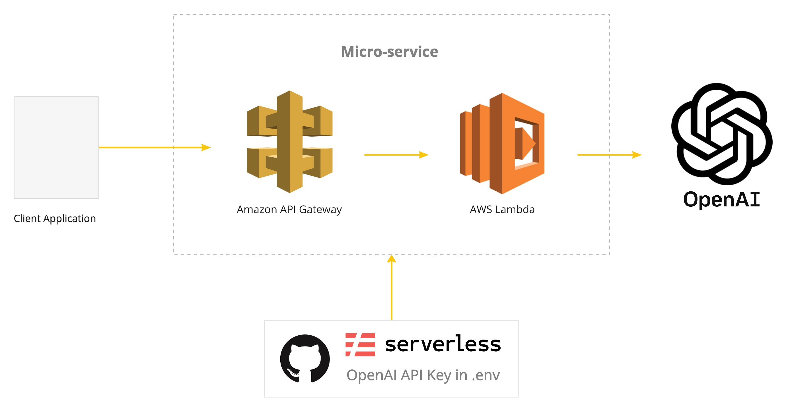

# sls-openai-api

__Purpose:__

When making client applications that utilize the [OpenAI API](https://openai.com/api/), you may want to encapsulate requests via a Micro-service layer ([see their documentation](https://beta.openai.com/docs/api-reference/authentication)). This repo creates a Micro-service for calling the OpenAI API using the following:

* Amazon Web Services
* Amazon API Gateway
* AWS Lambda
* serverless framework for Infrastructure-as-code
* .env to hold your OpenAI API key



__Deploying:__

Pre-requisites:
* You have the [serverless framework](https://www.serverless.com) installed and the [AWS CLI](https://aws.amazon.com/cli/) configured on your workstation.  This is the infrasructure-as-code tool that will deploy this Micro-service.  If not, you can refer to this [tutorial](https://www.serverless.com/framework/docs/getting-started).
* You have an OpenAI API key.  This can be created here: [https://beta.openai.com/account/api-keys](https://beta.openai.com/account/api-keys)

Steps:
1. Clone this repo.
2. Install project dependencies with:

````
npm install
````

3. Update .env file with your own OpenAI API key.
4. Deploy this micro-service to your own AWS Account with:

````
sls deploy
````
5. Use the deployed Micro-service to call the OpenAI API!
6. To clean up, you can tear down micro-service from your own AWS Account with:
````
sls remove
````

__Testing:__

* This repo uses [Jest](https://jestjs.io) for Unit Tests and [supertest](https://www.npmjs.com/package/supertest) for Integration Tests.
* Before running integration tests, update .env.test with your own API Gateway API_BASEURL.
* Both unit and integration tests can be run via:
````
npm test
````
* Test coverage can be run via:
````
./node_modules/.bin/jest --coverage
````